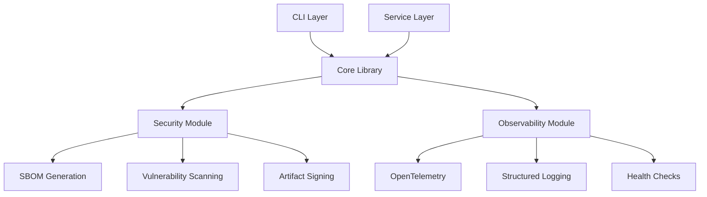

# Chiron Documentation

Welcome to **Chiron** - a frontier-grade, production-ready Python library and service focused on security, observability, and operational excellence.

## What is Chiron?

Chiron is designed for organizations that need:

- **Security-first development** with SBOM generation, vulnerability scanning, and artifact signing
- **Production-ready observability** with OpenTelemetry and structured logging
- **Modern Python packaging** following PEP 621/517 standards
- **Supply chain security** with SLSA provenance and reproducible builds
- **Operational excellence** with comprehensive health checks and monitoring

## Key Features

### 🔒 Security & Compliance
- **SBOM Generation**: Automatic Software Bill of Materials in CycloneDX and SPDX formats
- **Vulnerability Scanning**: Integrated scanning with Grype and Safety
- **Artifact Signing**: Keyless signing with Sigstore Cosign
- **SLSA Provenance**: Supply chain attestation and verification

### 📊 Observability
- **OpenTelemetry Integration**: Distributed tracing and metrics
- **Structured Logging**: JSON logs with trace correlation
- **Health Endpoints**: Kubernetes-ready health checks
- **Performance Monitoring**: Built-in metrics and profiling

### 🚀 Developer Experience
- **Modern Tooling**: uv for fast dependency management
- **Dev Containers**: Consistent development environment
- **Pre-commit Hooks**: Automated code quality checks
- **Rich CLI**: Comprehensive command-line interface

### 🏗️ Architecture
- **Library Mode**: Use as a Python library in your applications
- **Service Mode**: Deploy as a FastAPI service with OpenAPI docs
- **Plugin System**: Extensible architecture with entry points

## Quick Examples

### Library Usage

```python
from chiron import ChironCore

# Initialize with configuration
core = ChironCore({
    "service_name": "my-app",
    "telemetry": {"enabled": True},
    "security": {"enabled": True}
})

# Process data with observability
result = core.process_data({"user": "alice", "action": "login"})
```

### Service Mode

```bash
# Start the service
chiron serve --host 0.0.0.0 --port 8000

# Visit http://localhost:8000/docs for API documentation
```

### CLI Operations

```bash
# Initialize project
chiron init

# Build with security features
chiron build

# Create release with SBOM and signatures
chiron release

# Health check
chiron doctor
```

## Getting Started

1. **[Installation](getting-started/installation.md)** - Install Chiron in your environment
2. **[Quick Start](getting-started/quickstart.md)** - Get up and running in minutes
3. **[Configuration](getting-started/configuration.md)** - Configure for your needs

## Use Cases

### Enterprise Applications
- Secure data processing with audit trails
- Compliance reporting and documentation
- Multi-environment deployment with consistent security

### API Services
- FastAPI services with built-in observability
- Automatic OpenAPI documentation
- Health monitoring and alerting

### CI/CD Pipelines
- Secure build processes with SBOM generation
- Artifact signing and verification
- Vulnerability scanning and reporting

### Air-gapped Environments
- Offline package bundles with verification
- Internal PyPI mirrors
- Complete dependency auditing

## Architecture Overview



## Community & Support

- **Documentation**: Comprehensive guides and API reference
- **GitHub**: Issues, discussions, and contributions
- **Security**: Responsible disclosure process
- **Releases**: Semantic versioning with detailed changelogs

## Next Steps

Ready to get started? Choose your path:

- 📚 **New to Chiron?** Start with the [Quick Start Guide](getting-started/quickstart.md)
- 🔧 **Integrating into existing project?** See [Library Usage](guide/library.md)
- 🚀 **Building a service?** Check out [Service Mode](guide/service.md)
- 🛡️ **Security focused?** Explore [Security Features](guide/security.md)
- 📊 **Need observability?** Learn about [Monitoring & Telemetry](guide/observability.md)